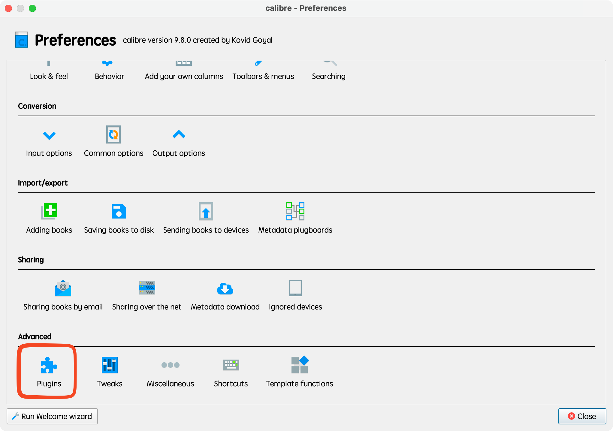
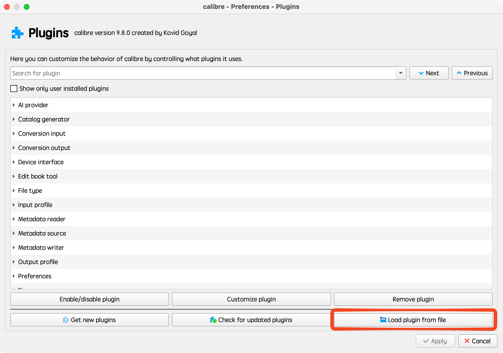
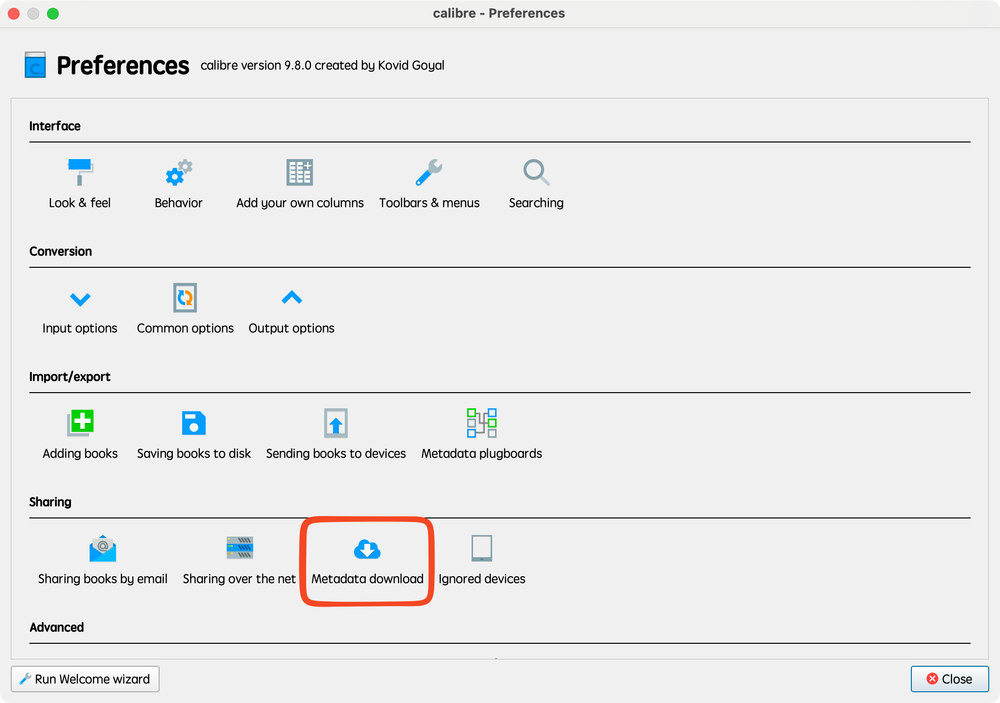
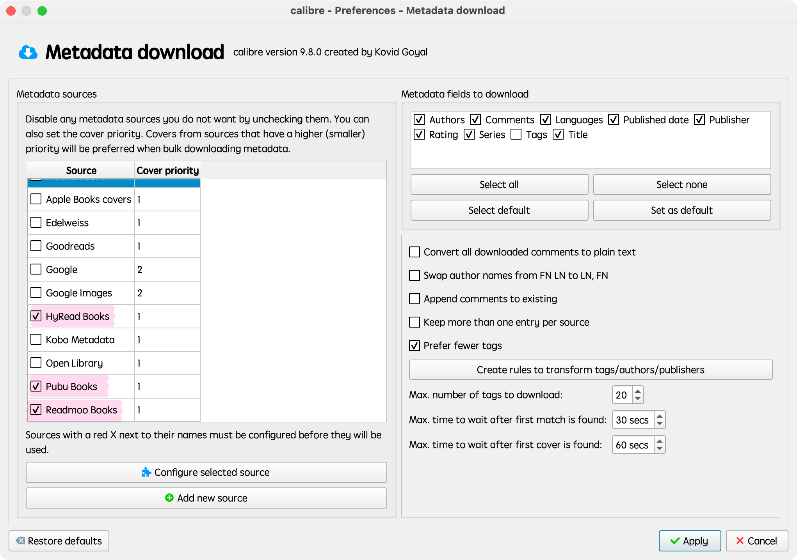

<p align="center">
  
</p>

# calibre-tw-ebook-metadata

> [繁體中文](README.md)

Calibre metadata source plugins for Traditional Chinese ebook stores.

Each plugin downloads **metadata and covers** via Calibre's built-in "Download metadata" feature. They work independently and can run alongside each other or any existing metadata source.

## Screenshots

### Installation

| Preferences > Plugins | Load plugin from file |
|:---:|:---:|
|  |  |

### Settings

| Preferences > Metadata download | Metadata sources enabled |
|:---:|:---:|
|  |  |

## Supported Sources

| Source | Site | Metadata Fields |
|--------|------|-----------------|
| **Readmoo** | [readmoo.com](https://readmoo.com) | Title, Authors, Publisher, Pub Date, ISBN, Tags, Description, Cover, Language |
| **HyRead** | [ebook.hyread.com.tw](https://ebook.hyread.com.tw) | Title, Authors, Publisher, Pub Date, ISBN, Tags, Description, Cover, Language, Series |
| **Pubu** | [pubu.com.tw](https://www.pubu.com.tw) | Title, Authors, Publisher, Pub Date, ISBN, Tags, Description, Cover, Language, Series |

## Installation

### From GitHub Release (recommended)

1. Download the .zip files from the [latest release](https://github.com/chiahsien/calibre-tw-ebook-metadata/releases/latest).

2. Install via command line:

   ```sh
   calibre-customize --add-plugin readmoo.zip
   calibre-customize --add-plugin hyread.zip
   calibre-customize --add-plugin pubu.zip
   ```

   Or via GUI: *Preferences > Plugins > Load plugin from file*.

3. Restart Calibre.

### From source (development)

1. Clone the repo and package:

   ```sh
   git clone https://github.com/chiahsien/calibre-tw-ebook-metadata.git
   cd calibre-tw-ebook-metadata
   make
   ```

2. Install from `dist/`:

   ```sh
   calibre-customize --add-plugin dist/readmoo.zip
   calibre-customize --add-plugin dist/hyread.zip
   calibre-customize --add-plugin dist/pubu.zip
   ```

## Usage

1. Select one or more books in Calibre.
2. Right-click > *Download metadata and covers*.
3. The plugins appear as sources named **Readmoo Books**, **HyRead Books**, and **Pubu Books**.
4. Calibre merges results from all enabled sources and lets you pick the best match.

### Search Behavior

- **Title + Author** is the primary search strategy for all three plugins.
- **ISBN** can be used as a search query (Readmoo, HyRead) or for post-filtering (Pubu).
- When an ISBN is provided and no exact ISBN match is found, results are still returned as fallback rather than discarded.

## Requirements

- Calibre >= 5.0.0
- Python 2/3 compatible (via Calibre's bundled Python)

## License

GPL v3

<a href="https://www.buymeacoffee.com/chiahsien" target="_blank"></a>
